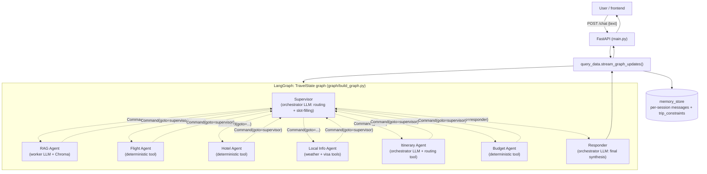

# ICS Travel Planner

A multi-agent travel-planning assistant built on **LangGraph** and **FastAPI**. It started as a single-node RAG customer-support bot and was extended into a supervisor/specialist multi-agent system that plans itineraries, searches flights and hotels, aggregates budgets, checks weather/visa requirements, and still answers product-knowledge questions through the original RAG pipeline — all through one FastAPI service and one `/chat` contract.

This repository doubles as the working basis for a research write-up on multi-agent orchestration design (routing mechanism, tiered model allocation, deterministic-vs-LLM-in-the-loop nodes, hop budgets) — see [`docs/research/`](docs/research/).

## Architecture



Eight nodes, four of which (`flight`, `hotel`, `local_info`, `budget`) are pure deterministic tool calls with no LLM step — a deliberate choice to keep structured-data retrieval and arithmetic free of hallucination surface. Routing is dynamic (`Command(goto=...)`) rather than a statically declared graph, so each node's routing decision lives next to the state update that produced it. See [`docs/02-agent-design.md`](docs/02-agent-design.md) for the full design rationale.

## Features

- **Itinerary planning** — single- and multi-city, with a nearest-neighbor routing heuristic for visit order
- **Flight & hotel search** — deterministic mock providers, swappable for real ones without touching agent logic
- **Budget aggregation** — greedy cheapest-combination selection with over-budget detection
- **Weather & visas** — live lookups via Open-Meteo (geocoding + forecast) and a static visa-requirement dataset
- **Product knowledge base (RAG)** — the original single-node assistant, preserved as one specialist agent, backed by a Chroma vector store
- **Tiered LLM allocation** — a larger model handles routing/slot-filling/synthesis; a smaller model handles narrow RAG-answer formatting (see [`docs/03-llm-infra-decision.md`](docs/03-llm-infra-decision.md))

## Documentation

| Doc | Content |
|---|---|
| [00-overview.md](docs/00-overview.md) | Start here — goals, non-goals, reading guide |
| [01-architecture.md](docs/01-architecture.md) | System diagram, request lifecycle, control flow |
| [02-agent-design.md](docs/02-agent-design.md) | Agent topology, state schema, handoff protocol |
| [03-llm-infra-decision.md](docs/03-llm-infra-decision.md) | LLM/infra choice, comparison matrix, ADR |
| [04-tools-and-integrations.md](docs/04-tools-and-integrations.md) | Per-tool spec: real vs. mock, swap-in path |
| [05-data-rag-pipeline.md](docs/05-data-rag-pipeline.md) | Ingestion, chunking, vector store |
| [06-api-reference.md](docs/06-api-reference.md) | HTTP endpoints |
| [07-security-and-secrets.md](docs/07-security-and-secrets.md) | Secret handling, a real incident and its fix |
| [08-evaluation-methodology.md](docs/08-evaluation-methodology.md) | How to measure this system in-repo |
| [research/RESEARCH-DIRECTION.md](docs/research/RESEARCH-DIRECTION.md) | Problem framing, contribution, open research questions |
| [research/RELATED-WORK.md](docs/research/RELATED-WORK.md) | Literature pointers (ReAct, Reflexion, TravelPlanner, etc.) |
| [research/EVALUATION-PROTOCOL.md](docs/research/EVALUATION-PROTOCOL.md) | Formal experimental design for a write-up |

## Tech stack

FastAPI &middot; LangGraph &middot; LangChain &middot; Chroma &middot; an OpenAI-API-compatible LLM provider

## Getting started

```bash
cd backend
mkdir -p data/pdf   # drop product/policy PDFs here for the RAG knowledge base

cp .env.example .env
# edit .env and set LLM_API_KEY to an OpenAI-API-compatible provider key

pip install -r requirements.txt
python seed_db.py          # build the Chroma vector store from data/pdf
uvicorn main:ICS --reload  # serves the chat UI at http://127.0.0.1:8000/chat
```

To change host/port:

```bash
uvicorn main:ICS --reload --host 0.0.0.0 --port 8080
```

## Status

Flight/hotel data are deterministic mocks, not live market data — an explicit scoping decision documented in [`docs/04-tools-and-integrations.md`](docs/04-tools-and-integrations.md) so any accuracy claim is understood to be about orchestration logic, not real-world booking correctness. See [`docs/research/RESEARCH-DIRECTION.md`](docs/research/RESEARCH-DIRECTION.md) for the full list of threats to validity and suggested future work.
