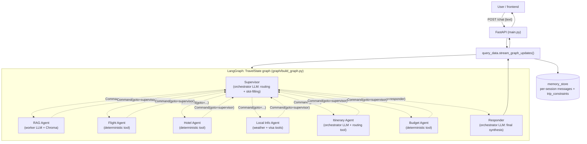
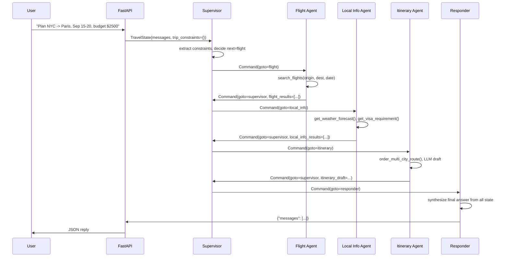

# Architecture

## Component overview

Source of truth for node/edge names: `backend/graph/build_graph.py`.

## Request lifecycle

1. `POST /chat` (`backend/main.py`) receives `{ "text": ... }`, keyed by
   the caller's IP as a coarse session id (unchanged from the original
   single-node implementation).
2. `stream_graph_updates()` (`backend/query_data.py`) loads that session's
   prior messages and `trip_constraints` from `memory_store`, appends the
   new `HumanMessage`, and builds a `TravelState` (see
   [02-agent-design.md](02-agent-design.md) for the schema).
3. `graph.invoke(state, ...)` runs the compiled LangGraph until it reaches
   `END`. Internally, control passes back and forth between the
   `supervisor` node and specialist nodes via `Command(goto=...)` objects
   returned directly by each node — see
   [02-agent-design.md](02-agent-design.md) for why this dynamic
   handoff pattern was chosen over static `add_conditional_edges`.
4. The `responder` node is the only node with a static edge to `END`; it
   composes the final `AIMessage` from every structured result the
   specialists produced.
5. `stream_graph_updates()` persists the updated `trip_constraints` and
   trimmed message history back into `memory_store`, and returns the
   reply text to the FastAPI layer.

## Representative multi-hop trace

Each hop appends one entry to `agent_scratchpad` (an `operator.add`-reduced
state channel), giving a per-turn audit trail of which agents ran, in what
order, and why (`RouteDecision.reasoning`). This trail is what
[08-evaluation-methodology.md](08-evaluation-methodology.md) uses for
tracing.

## Robustness

`MAX_HOPS_PER_TURN` (`backend/agents/supervisor.py`) bounds the
supervisor↔specialist loop at 6 hops per user turn, after which the graph
is forced to `responder` regardless of the LLM's routing decision. This
guards against routing loops (e.g. the supervisor repeatedly re-selecting
an agent that cannot make progress because a required constraint is still
missing) turning into unbounded cost/latency.

Diagram sources are duplicated as standalone `.mmd` files under
`docs/diagrams/` for export into other tools.
